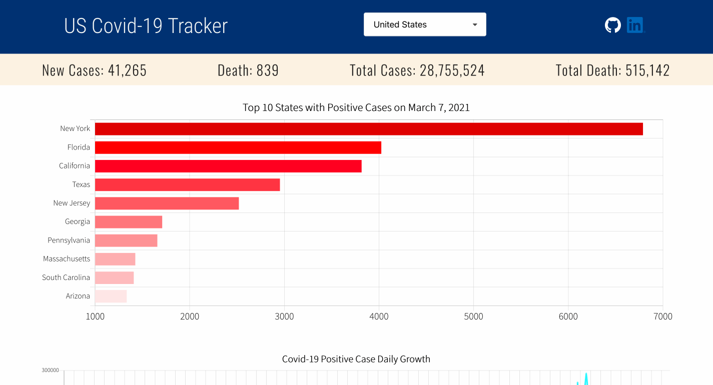
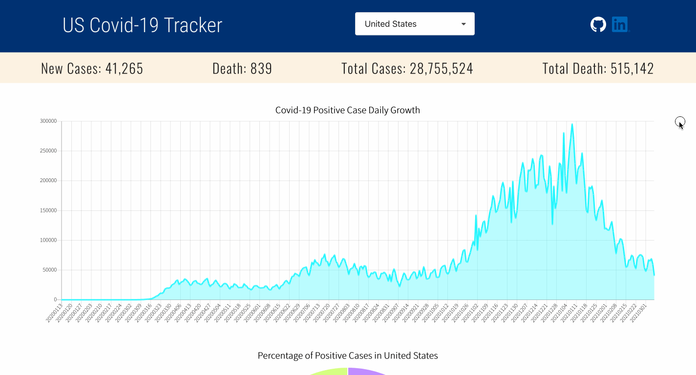
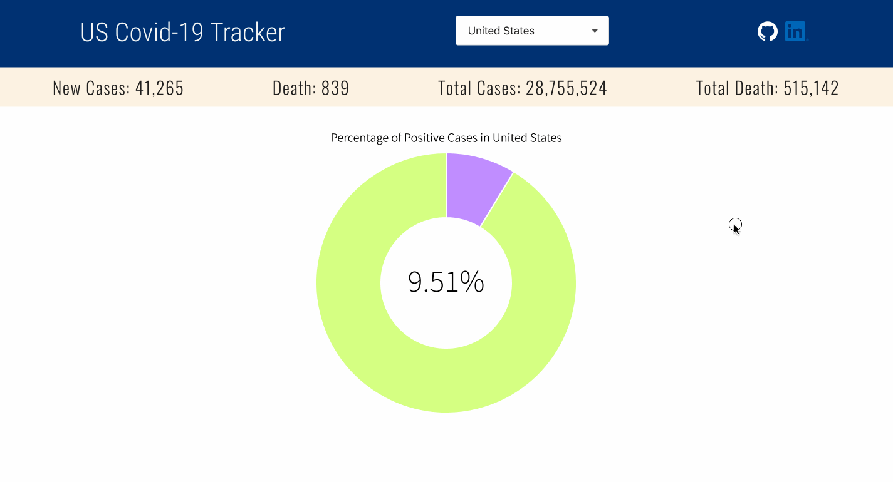

# US COVID-19 Tracker

**This US Covid-19 tracker...**

- [x] Updates daily (Note: The Covid Tracking Project API is no longer collecting new data as of March 7, 2021, so this tracker will show data up until that date.)
- [x] Shows COVID-19 summary data and 3 different types of chart: bar, line, pie for all 50 states and US as a whole
- [x] Uses the API from the [Covid Tracking Project](https://covidtracking.com/data/api) and [US Census Bureau](https://www.census.gov/data/developers/data-sets/popest-popproj/popest.html) and [Chart.js](https://www.chartjs.org/) library for HTML5 based JavaScript charts
- [x] Uses React framework for front-end and Node.js for back-end

Check out the project [here](https://covid-tracker-web.herokuapp.com/)!

## Demo
### Bar Graph: Top 10 States with Covid-19 Positive Cases

### Line Graph: Number of Covid-19 Positive Cases since inception for each state

### Circle Graph: Percentage of Cumulative Covid-19 Positive Cases for each state

